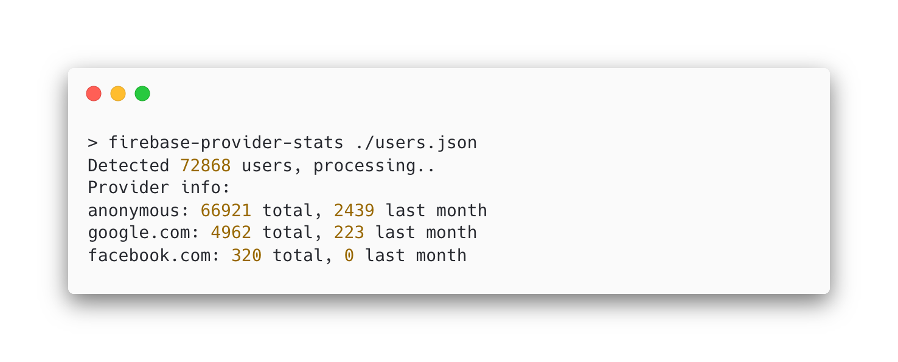

# firebase-provider-stats

Tiny nodejs based tool to calculate some quick stats based on Firebase Auth.



## Why this project?

Because I needed to figure out if my Facebook provider was still worth having in my project or if I could safely just wipe it by looking at the number of users that was registered with Facebook.

Firebase auth is amazing at removing the pain of authentication handling and securing logins. However, when it comes to providing data about who is registered, you need to add some effort yourself.

## Usage

First, you need to download your auth data. This is most easily done using the [firebase cli](https://firebase.google.com/docs/cli):

```bash
firebase --project <optional> auth:export users.json
```

Then you run this little tool to get the data out:

```bash
npm install -g firebase-provider-stats
firebase-provider-stats users.json
```

## Build

To install dependencies and run locally:

```
npm install
npm link
firebase-provider-stats <your-file>
```

And to test:
```
npm test
```

This will use the provided example testfile `example.json`.

## Publishing

Publishing to NPM is done automatically by any tag.

1. Update version in [package.json](package.json)
2. Tag it with `git tag vx.x.x` and `git push origin vx.x.x`
3. Sit back and let it build

## Credits

Big shoutout to [LogRockets article on creating CLI tools](https://blog.logrocket.com/creating-a-cli-tool-with-node-js/)

## License
The MIT License (MIT)